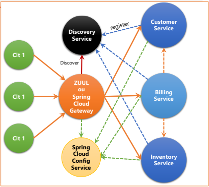

# Microservices Spring Boot - Architecture & Ops

Ce projet illustre une architecture microservices basée sur Spring Boot, Spring Cloud, Eureka, Feign, et H2 Database. Il comprend :

## Microservices

- **config-service** : Serveur de configuration centralisé.

- **discovery-service**  
  Service Eureka pour la découverte des microservices. Il centralise l’enregistrement et la localisation des autres services.

- **gateway-service**  
  API Gateway basée sur Spring Cloud Gateway. Elle route les requêtes vers les microservices selon des règles définies (ex : `/customers/**` vers customer-service, `/products/**` vers inventory-service).

- **customer-service**  
  Gère les clients (CRUD). Expose des endpoints REST et stocke les données en base H2 en mémoire.

- **inventory-service**  
  Gère les produits (CRUD). Expose des endpoints REST et stocke les données en base H2 en mémoire.

- **billing-service**  
  Gère la facturation. Récupère les clients et produits via Feign auprès des autres services. Stocke les factures et items en base H2.

## Partie Ops / Actuator

Chaque microservice expose des endpoints Actuator pour la supervision et la gestion :

- **Actuator** permet d’accéder à des informations sur l’état de l’application, la santé (`/actuator/health`), les métriques (`/actuator/metrics`), les logs, etc.
- L’exposition des endpoints est activée via :  
  `management.endpoints.web.exposure.include=*`  
  (présent dans `inventory-service`, à ajouter dans les autres services si besoin).

## Circuit Breaker

Pour améliorer la résilience, il est recommandé d’intégrer un mécanisme de **circuit breaker** (ex : avec Resilience4j ou Spring Cloud Circuit Breaker). Cela permet de :

- Prévenir les appels répétés vers un service en panne.
- Fournir des réponses de secours (fallback) en cas d’indisponibilité d’un microservice.
- Surveiller l’état des communications entre services via les endpoints Actuator (`/actuator/health` inclut l’état du circuit breaker si activé).

**Exemple d’intégration** :  
Ajouter la dépendance `spring-cloud-starter-circuitbreaker-resilience4j` dans le microservice concerné et annoter les méthodes Feign ou RestTemplate avec `@CircuitBreaker`.

## Lancement

1. Démarrer `discovery-service` :  
   `mvn spring-boot:run -pl discovery-service`
2. Démarrer les autres services :

   `mvn spring-boot:run -pl config-service`

   `mvn spring-boot:run -pl customer-service`  
   `mvn spring-boot:run -pl inventory-service`  
   `mvn spring-boot:run -pl billing-service`
3. Démarrer `gateway-service` :  
   `mvn spring-boot:run -pl gateway-service`

## Accès

- **Eureka Dashboard** : [http://localhost:8761](http://localhost:8761)
- **API Gateway** : [http://localhost:8888](http://localhost:8888)
- **Console H2** : `/h2-console` sur chaque service (ex : [http://localhost:8081/h2-console](http://localhost:8081/h2-console))
- **Actuator** : `/actuator` sur chaque service (ex : [http://localhost:8082/actuator](http://localhost:8082/actuator))
- **Configuration globale** : `/application/default` configuration par défault (ex : [http://localhost:9999/application/default](http://localhost:9999/application/default))
- **Configuration de chaque service** : `/service/env` configuration de chaque service selon l'environnement (ex : [http://localhost:9999/customer-service/dev](http://localhost:9999/customer-service/dev)) (ex : [http://localhost:9999/customer-service/prod](http://localhost:9999/customer-service/prod))
- **Configuration par défaut de chaque service** : `/service/default` configuration par défault de chaque service (ex : [http://localhost:9999/customer-service/default](http://localhost:9999/customer-service/default))

## Technologies

- Java 17+
- Spring Boot, Spring Cloud (Eureka, Gateway, OpenFeign)
- H2 Database
- Maven

## Schéma d'architecture

---

_Auteur : Soufiane El Ghariaoui_